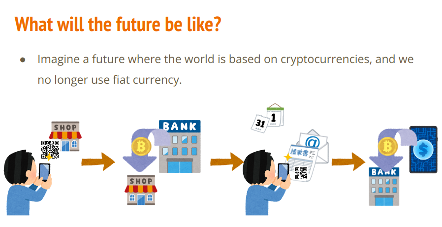
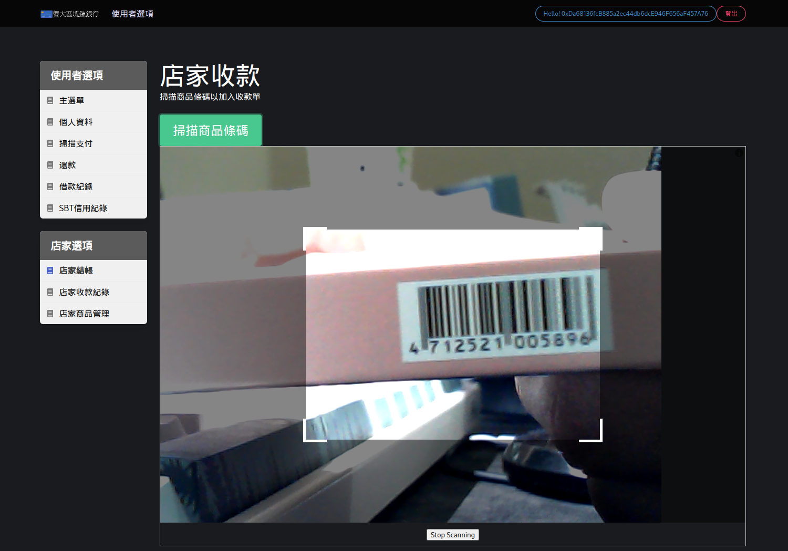
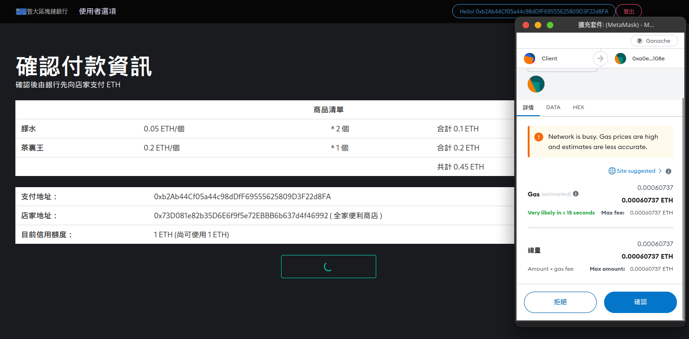
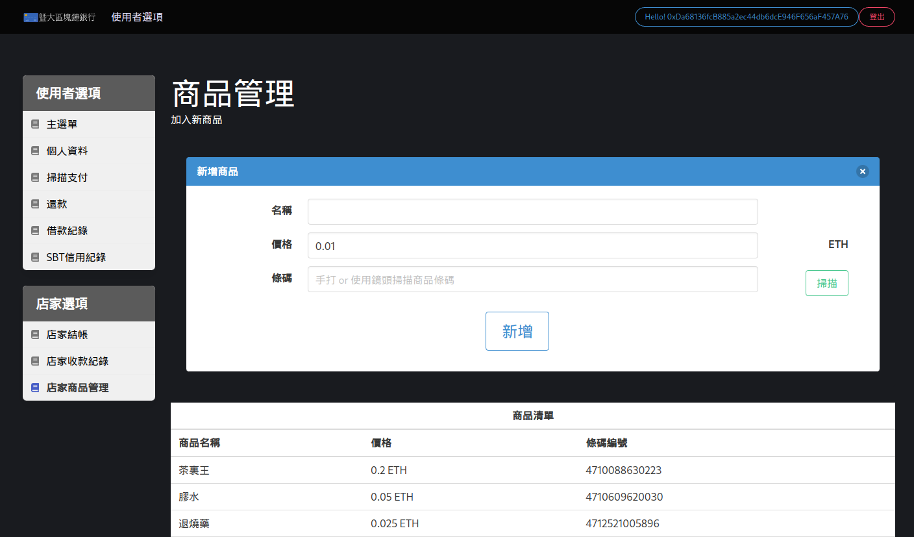

# Credit-Card-System-web

It's final project for 1112 NCNU CSIE "Principles and Practice of Blockchains"

We have implemented a Crypto Credit Card System, and this repository focuses on the web interface part.

However, many functions have not been fully implemented, and there are still numerous security issues that need to be addressed.

Additionally, You can find smart contract [here](https://github.com/snsd0805/Credit-Card-System-smartcontract)


## Recommended IDE Setup

[VSCode](https://code.visualstudio.com/) + [Volar](https://marketplace.visualstudio.com/items?itemName=Vue.volar) (and disable Vetur) + [TypeScript Vue Plugin (Volar)](https://marketplace.visualstudio.com/items?itemName=Vue.vscode-typescript-vue-plugin).

## Customize configuration

See [Vite Configuration Reference](https://vitejs.dev/config/).

## Project Setup (Frontend)

1. Deploy the contracts in the [smart contract repo](https://github.com/snsd0805/Credit-Card-System-smartcontract)
2. clone this repo
    ```
    git clone $THIS_REPO_LINK
    ```
3. Install the project dependencies
    ```
    cd Credit-Card-System-web
    npm install
    ```
4. Copy `.env.example` to `.env`, and edit your configurations.
    ```
    cp .env.example .env
    vim .env
    ```

    ```
    VITE_CHAIN_ID = the ID of the blockchain which you deployed, like 0x539(5173) is for Ganache
    VITE_SBT_ADDR = SBT contract's address
    VITE_BANK_ADDR = Bank contract's address
    VITE_BACKEND_PREFIX = Your backend server's prefix url: like http://192.168.0.102:5000
    VITE_FRONTEND_PREFIX = You frontend's prefix: like http://192.168.0.112:5173
    ```
5. Compile and Hot-Reload for Development
    ```
    npm run dev
    ```

    or you can Minify for Production

    ```
    npm run build
    ```

## Project Setup (Backend)

1. Run backend api server
    ```
    cd Credit-Card-System-web/backend
    python main.py
    ```

## Usage

After setting up the frontend and backend servers, you can open your browser and access the frontend page.

Once the page is loaded, you can connect your MetaMask wallet and proceed to register and log in to the application.

## Some Demo Screenshots


